## 원티드 프리온보딩의 과제수행 겸 회고글

 

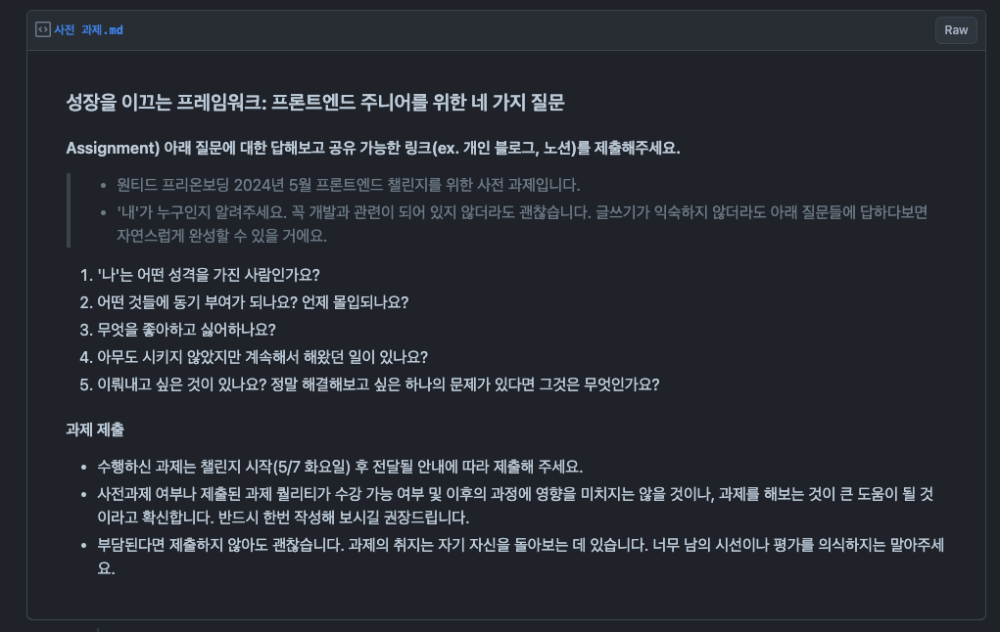

개발을 접한지 약 1년이 지나가고 있는 정신없는 요즘 생각이 많아진다. 지금 나의 상태는 어떤지 나는 어떤 사람인지 짚어 보면서 마음을 다져본다(?)

## 1. '나'는 어떤 성격을 가진 사람인가요?

 

<!--  -->

가장 어려운 질문이다 🤔   스스로는 살면서 겪은 경험들로 인해 어느 정도 파악하고 있지만 이것을 정의를 하라고 하면 꼬리의 꼬리를 무는 생각에 잠겨 머리 밖으로 잘 안 나온다. 이 부분은 대중적으로 잘 설명되어 있는 MBTI의 힘을 잠시 빌려 본다. 처음에 한창 MBTI로 시끌 할 때 이런 걸 뭐하러 하냐고 했던 사람인데 직접 해보고 나서 **어느 정도** 일리가 있다고 인정을 하게 된 **[INTP](https://namu.wiki/w/INTP)** 이다.

나무위키의 설명이 전반적으로는 맞지만 100%는 아니기에 좀 더 다듬어 나를 정의하는 연습을 해보겠다.

<!--   -->

<!-- - 항상 궁금증이 많다.
- 근본적인 원인을 알고 싶어 한다.
- 공상과 상상 속에 있을 때가 많다.
- 비논리적이라고 생각되는 의견에는 끝까지 반박하지만 만약 상대방의 말이 논리적으로 맞다고 생각되면 감정에 휘둘리지 않고 곧바로 수긍한다.
- 타인의 비판에 개방적이고 또 입체적으로 사고한다.
- 편견 및 고정관념이 적다.
- **관심**을 가지고 있는 대상에 대한 모든 것을 알고 싶어 하고 탐구한다.
- 사교적으로 말을 꺼내길 어려워한다. 하지만 막상 친해지기가 어려워서 그렇지 친해지고 나면 유머 감각이 뛰어나고 인싸와 구별할 수 없다.
- 자신에게 중요한 것이 아니면 잘 잊어버린다. -->

## 2. 어떤 것들에 동기 부여가 되나요? 언제 몰입 되나요?

 

나의 생각보다 더 나은, 더 높은 단계의 것을 마주했을 때 존경심과 함께 강한 동기가 생긴다. 이러한 동기와 관심사가 겹치게 되는 지점에 몰입도가 폭발한다. 몰입 되는 순간에는 평소와 다르게 잡생각 없이 집중력이 발휘되어 멈추지 않고 몰입이 계속해서 지속되는 거 같다. 혹은 **갑자기 아이디어가 번뜩**이거나 **이게 뭐지?**로 시작해서 자연스럽게 몰입되는 경우도 있다. 반면 흥미가 떨어진다거나 생각한 목표지점에 다다르면 몰입이 쉽게 깨지는 경향이 있다.

나는 나의 성격을 이해하고 있기에 잘 이용해야 하는 연습을 해야 한다. 어떻게 보면 최고의 효율로 만족스러운 결과를 내기도 하지만 반대로 조금만 어긋나면 생각만 하다가 아무것도 하기 싫어지는 상태로 진입하게 되기 때문에 꾸준한 퍼포먼스를 유지하기 위한 최적의 루틴을 테스트하는 중이다.

## 3. 무엇을 좋아하고 싫어하나요?

 

가장 좋아하는 걸 고르자면 음악과 영상이다 그리고 **무언가 만드는 행위를 좋아한다**.

어떤 영향인지는 확실치는 않지만 짐작해 보면 외삼촌들의 영향이 묻은 것 같다. 어릴 적 작은 삼촌은 동네서 알아주는(?) 소위 잘나가는 딴따라였다 하고 나중에는 펍을 운영했다. 특히 외국인들에게 핫플이였다. 작은 삼촌의 방에는 항상 약간의 담배 향기와 미묘한 쾌적함이 같이 공존했고 큰 스피커를 통해 음악이나 게임 소리를 영화관 사운드처럼 듣곤 했다. 아직도 그 방에 남아있는 기억은 우퍼를 통해 몸을 때리는 Usher, Nas의 노래와 작은 삼촌이 즐겨 하던 리니지2 정령탄 소리다. 10살 언저리의 나는 작은 삼촌의 아이오디오 mp3의 플레이 리스트들로 음악을 처음 듣게 되었고 팝을 기반으로 넓혀가며 취향이 형성되었다.

큰 삼촌은 PD였다. 외가에 놀러 갈 때면 항상 큰 삼촌의 카메라들과 장비들이 있었다. 나를 항상 찍으며 괴롭혔던 영상들이 많이 남아있다. 자연스럽게 카메라에 관심이 있었고 영상들을 거부감 없이 접하곤 했던 거 같다. 그러다 보니 영상 미디어를 전공했고 지금도 좋아하는 분야이다. 이런 특징들로 뮤직비디오나 패션 브랜드의 런웨이 쇼 혹은 영화나 광고 보는 걸 좋아한다. 또는 3D 오브젝트나 시각화에도 관심이 많아 블렌더나 터치 디자이너로 만드는 작업물들도 좋아한다. 내가 좋아하는 요소들이 다 들어가 있다. 그래서 그런지 비슷한 카테고리의 음악이나 영상 만드는 걸 좋아했고 영화나 광고 마케팅 등에 이어 앞으로 웹 시장에도 3D 오브젝트가 더 많이 사용될 것이라고 개인적으로 생각하고 있다. 좋아하는 걸 무에서 유로 만들어낼 때 도파민 분비가 샘솟는 기분

그리고 당시에 큰 삼촌이 데려와 키웠던 너무나 사랑스러웠던 골든리트리버 금순이가 있었는데 암컷이라 금순이다 수컷이면 금돌이였을듯 하다. 강아지를 좋아하고 골든리트리버에게 빠진 계기가 되었다. 아직도 씻지 않은 금순이의 뭔가 쿰스쿰스한 냄새가 생각난다.

싫어하는 걸 굳이 생각해 보자니 바로 떠오르진 않는데 종합적으로 볼 때 쓸데없는 걸 좋아하지 않는다. 여기서 말하는 쓸데없는 것은 광범위하게 적용되는 것 같다. 내 기준에 쓸데없다고 생각되는 모든 것을 싫어한다.

## 4. 이뤄내고 싶은 것이 있나요? 정말 해결해 보고 싶은 문제가 있다면 그것은 무엇인가요?

 

IT 분야의 일이 워낙 다양하다 보니 정확히 분류가 되는 것 같지는 않지만 정의해 보자면 웹 그래픽스 엔지니어라고 불리는 일들을 해보고 싶다. 관련 일을 하시는 분들의 인터뷰나 설명들을 본 적이 있는데 전반적인 개발에 대한 이해도도 필요하며 추가적으로 3D를 다루는 기술과 그걸 잘 소화할 수 있는 수학적 요소도 필요한 것 같다. 지금 나에게 이뤄내고 싶은 것이 있냐 물어본다면 이 분야를 내 것으로 이뤄내보고 싶다. 또 나와 잘 맞는 사람들을 찾아 하나의 팀을 만들어 주체적으로 운영할 수 있는 서비스를 만들어내고 싶다. 이게 꼭 비즈니스적으로 성공하지 못하더라도 너무 재밌을 거 같아 살면서 꼭 해보고 싶은 경험이다. 내가 좋아하는 사람들, 잘 맞는 사람들과 무엇을 같이할 때 나오는 에너지와 힘을 알고 있기에 개발에도 이 점을 적용시킨다면 더할 나위가 없을 거 같다는 생각이 든다. 게다가 이건 실체로 만들어 낼 수 있지 않는가

앞으로 인력은 점점 없어질 테고 좋은 사람 찾기는 더욱 힘들어질 거다. 이런 와중에 나와 잘 맞는 사람을 찾기란 하늘에 별 따기일 수도 있다고 생각된다. 주변에 자기 사업을 하거나 자기 일을 하는 친구들 보면 사람 찾기 바쁘다. 같이 일할 수 있다는 건 서로 믿고 신뢰할 수가 있어야 한다는 건데 이게 정말 쉽지가 않다는 거다. 나는 이 상호작용이 잘 맞을 수 있는 나의 팀을 만들어 뭐 하나 해보고 싶은 야망을 가슴속 저 아래 품고 있긴 하다. 물론 그전에 내가 먼저 좋은 사람이 되어 그들에게 어필을 할 수 있도록 노력해야 한다.

## 회고

## 📅 나의 1년 목차

- 개발자?
- GPT의 등장과 나의 생각
- 부트캠프 대장정
- 부트캠프 수료
- 우테코 프리코스
- 스터디와 사이드 프로젝트

## 개발자?

 

때는 22년 코로나 시절 모든 일을 멈추고 나는 무엇인가(?)에 대한 고찰로 시간을 보내던 때
뉴스, 언론 등 비치는 IT 관련 내용들에 대해 생각해 본 적이 있었다.

팬데믹으로 인한 실업률 상승, 디지털 전환 가속화, IT 인력 수요 증가, 정부 지원 확대 그로 인해 쏟아지는 부트 캠프, 학원 광고들
뭔가 거품이 잔뜩 보이는데 하는 사람이 있는 건가? 개발을 아무나 할 수 있는 게 아닐 텐데 🤔 하고 생각하며 크게 관심을 가지진 않았지만 궁금증은 유발되었다. 마침 시간도 있겠다 뭐길래 그럴까 하고 찾아보다가 **생활코딩** 을 접하게 된다.

이고잉 선생님의 **빨려 드는 강의력, 짙은 호소력의 목소리, 미쳐버리게 깔끔한 영상 구성과 편집**
첫 순간은 매료가 되었고 영상을 따라서 웹페이지를 만들었다. 하지만 거기까지! 좋은 내용이지만 이건 기본 중의 기본이며 이런 걸 일로 접근하게 된다면 쉬운 일이 아니라는 걸 알고 있었고 흥미는 잠시 덮어둔다.

## GPT의 등장과 나의 생각

### 인간시대의 끝이 도래했다?

그렇게 잠깐의 HTML 찍먹 해보고 시간이 흘러 연말이 다가올 즈음 **그것이 세상에 나왔다.**

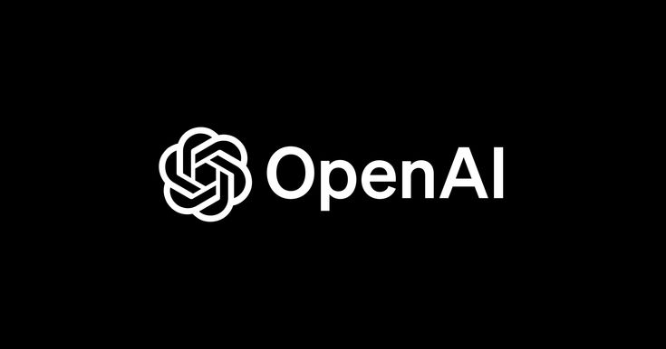

이것은 생각뿐인 나에게 바로 행동을 취하게 만드는 사건. 인터넷은 GPT로 불타오르고 유튜브는 뜨거웠다.

내 관심사의 집합체였던 GPT는 나를 다시금 생각하게 만들었다.
**'거품이고 시장이 어떻고의 문제가 아니라 이건 더 이상 몰라서는 안된다.'**

GPT는 나에게 신선한 충격이었다. 상상으로만 하던 일들이 앞으로 가능할 거 같은 순간이었다. 나의 도파민은 폭발했고 빠져들었다.
GPT가 나온 후로 계속해서 사용해 보기 시작했고 새벽에 무단횡단하는 친구에게도 알려주면서 GPT를 써보라고 친절히 보여줬다.

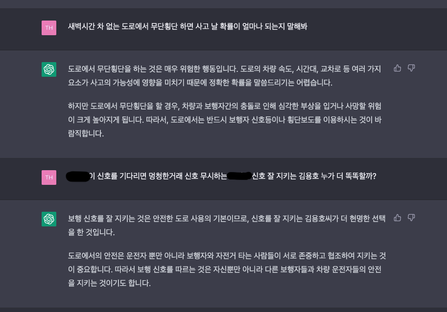
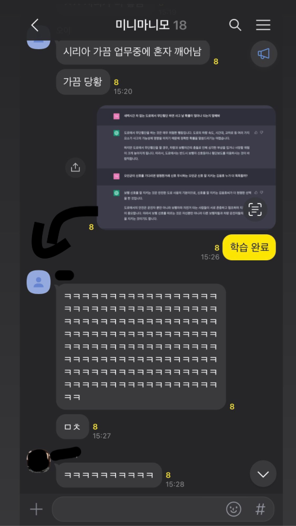

GPT의 제한을 풀기 위한 가스라이팅, 질문의 대답이 끊어지지 않고 지속되게 하는 단어, GPT 할루시네이션을 줄이는 방법 등 재미지게 인터넷을 돌아다니며 구경했고 많은 얘기들이 보이기 시작한다.

- AI 시대의 도래?
- IT 직종의 종말?
- 개발자는 이제 필요 없다

무슨 바보 같은 자신감이었는지 나는 오히려 반대가 아닌가?라는 판단에 오히려 저 영역에 가장 가까운 일이 무엇인가를 생각했고
생활코딩으로 시도해 본 개발이라고 판단이 되었다.

**나는 보았고 느꼈고 결정했다. ~~(대충 부트 캠프 찾으러 다녔단 말)~~**

### 근데 뭐부터 해야 하지?

마음의 결정은 내렸는데 머리는 비어있었고 닥치는 대로 정보를 찾아봤다.

- 국비,부캠 출신 개발자의 취업
- 프론트와 백엔드의 차이
- 현재 쏟아지는 AI 부트 캠프의 진실
- 부트 캠프를 웹으로 시작해야 되는 이유
- 부트 캠프들의 단점, 실시간으로 목도한 부트 캠프 후기들의 삭제 (찾고 있던 부트캠프 관련 글인데 다음날 사라져있음)
- 개발자가 되려면 알아야 하는 것들

그리고 나는 가장 조건에 맞는 부트캠프를 찾아냈고 개발지식이 전무한 나는 **데이터 부트캠프에 들어갔다(?)**. 빠밤-

 

- 그 당시 정부 지원 때문인지 AI 어쩌고 빅데이터 어쩌고 부트캠프가 많았다
- 가장 빠른 시기에 오프라인으로 참여할 수 있고 나름(?) 알려져 있고 접근성 좋은 유일한 부트 캠프였다
- **일단 개발관련 경험을 빨리 시작하고 싶었다**
- 위에 찾아본 정보를 취합해 볼 때 비전공자이고 개발경험이 없다면 이 선택이 부정적일 수도 있다는 걸 인지하고 있었다
- **사람은 맞아야 정신 차린다**
- 아쉽게 내가 여기와 안 맞았을 뿐 좋은 건 좋았다...!

## 부트캠프 대장정

6개월동안 무슨 경험을 했고 어떤걸 얻었을까?
 

### 데이터 분석,머신러닝,딥러닝이 뭔지 안다 아니 한다는 게 아니고 할 줄은 안다

파이썬은 기억 속에서 사라졌지만 꺼내 먹을 수는 있다. colab PyTorch lgbm adam let's go

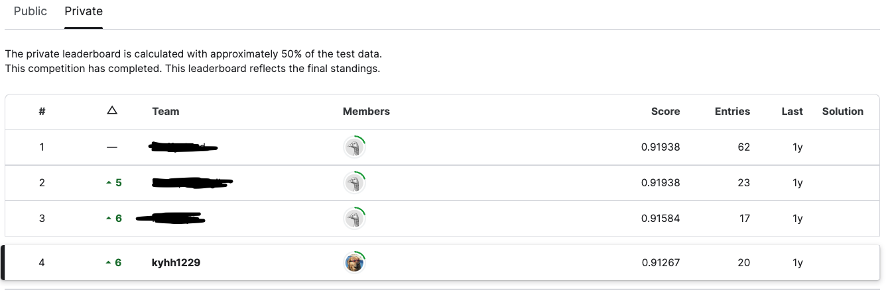

캐글에서 타이타닉 생존자 예측분석을 진행하던 중 점수가 잘 나왔다고 내심 좋아했던 때다

기본적인 결측치 제거,데이터 전처리 이후 탑승 클래스별,성별이였던거 같다 이름마다 계급을 유추해서 계급별 전처리를 해줬었나 기억이 가물한데 점수가 크게 오른 데이터 전처리가 있었다. 클래스에서 친해진 동생이 있는데 모르는 걸 잘 알려줘서 재밌게 했던 경험이다.

### GPT와의 전쟁

과정 도중 데이콘에서 내 관심을 쏙 빼놓는 대회가 열렸다. **무려 최초로 GPT를 이용한 경진대회**

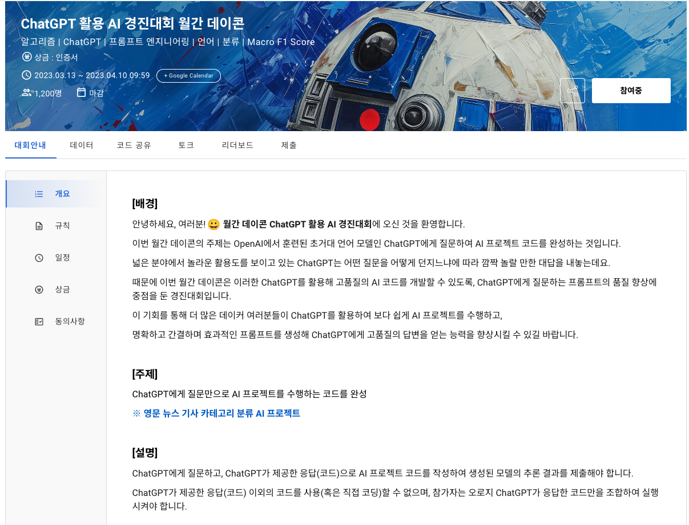

고양이가 생선을 지나칠까 나는 대회에 꽂혀서 매일 미친 듯이 프롬프팅을 시도했다. 지식은 여전히 부족했지만 정말 어떻게든 점수를 내보고 싶었다. 알고 있는 여러 모델을 이것저것 명령하며 바꿔가며 몇 줄만 수정되게도 시켜보며 1점 1점 끌어올리면서 끌고 갔다. 보통 3분 만에 학습이 끝나거나 오래 걸려도 20분이면 끝났는데 1시간이 넘어도 멈추지 않는 범상치 않은 놈이 걸렸다

그렇게 마지막 시도를 하게 되는데 아직도 기억이 생생하다.

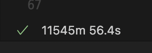

#### 11545m 56.4s

대략 8일, 정확히 192시간이 흘렀고 강의 중이었는데 초록색 체크를 보고 나도 모르게 소리쳤다.
맥북을 애지중지 안전하게 들고 다니며 돌아가는 로딩을 보살폈다. 클래스 동료들이 그거 안되는 거라고 아직도 하고 있냐고 그거 왜 하냐고 할 때 뭐에 꽂힌 거 마냥 꿋꿋이 돌린 게 8일이 지난 거다

기대 만발로 바로 submission을 때렸다
나 혹시 TOP 10 되는거 아닐까

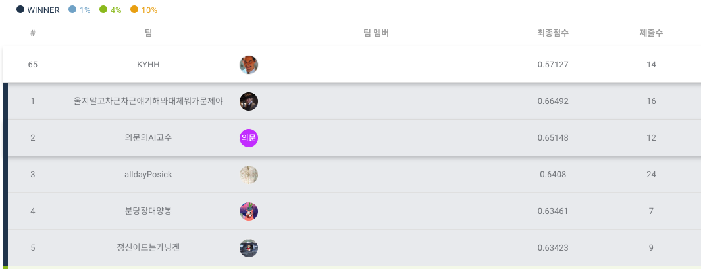

0.57127
65등으로 종료.

저 땐 몰랐는데 모델을 잘못 사용했던 것 같다. 다뤄야 할 데이터가 영문 뉴스 기사 카테고리 분류였고 자연어 처리에 좋은 모델은 NLP라고 한다. 딥러닝을 사용했으면 더 높은 점수가 나왔을 거 같다. 나는 타이타닉 예측하던 대로 무적의 lgbm 모델로 머신러닝을 사용했다. 몰랐기에 아쉬웠고 1200명 중 65등 했다고 아쉬운 만족을 했던 경험이다. (사실 이 정도 등수는 의미가 없는 거 같다)

### 파이널 프로젝트

 

많은 우여곡절이 지나고 머리에 든 거도 없는데 파이널 프로젝트 시기가 왔다. 이때 나는 프론트 분야의 기술들이 나와 가장 잘 맞고 관심이 많은 카테고리라고 생각되었고 프론트쪽을 공부하기로 정했었다. 하지만 데이터 부트캠프였기에 프론트 지식은 전무했고 한두 달 남은 시간에 나는 혼자서 스스로 프론트를 공부하게 되었다. 정말로 구현만을 위해서 무작정 시작했다. 자바스크립트도 모르지만 리액트를 사용했고 CSS는 어떻게 사용해야 되지를 고민할 때 당시 자주보던 플랫폼이 커리어리였는데 커리어리 웹사이트를 개발자도구로 살펴보니 tw 라는 키워드를 발견해 tailwind를 알게되어 따라 사용했다. 모르는건 구글링과 gpt를 이용해 코드들을 긁어긁어 찍어봤고 정말 무지성 구현을 한 것 같다.

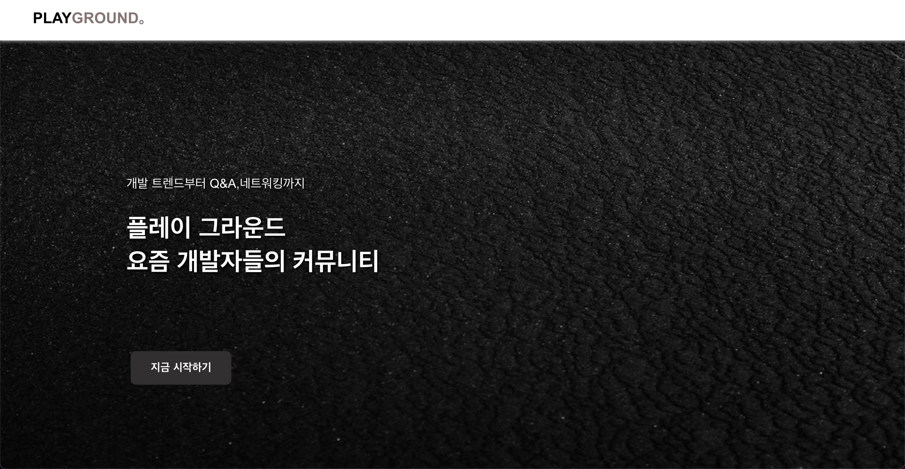
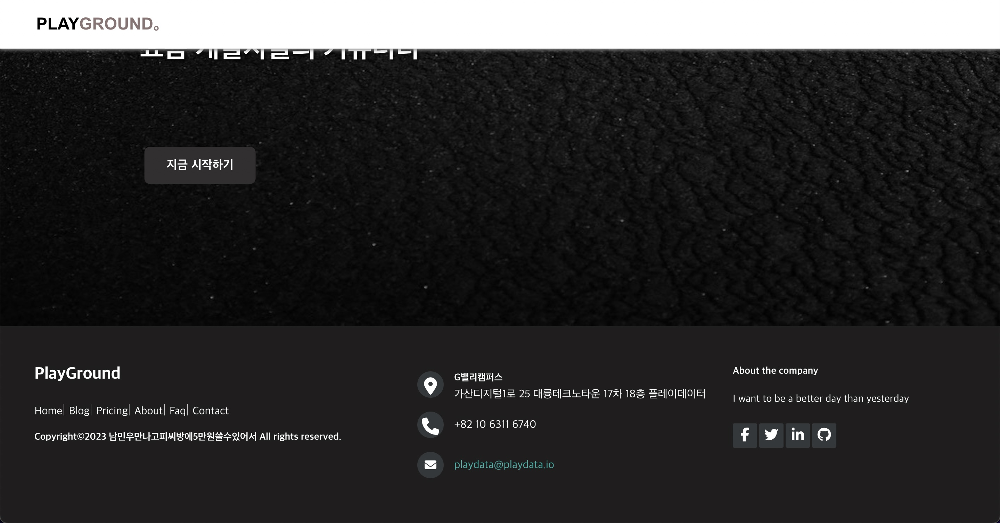
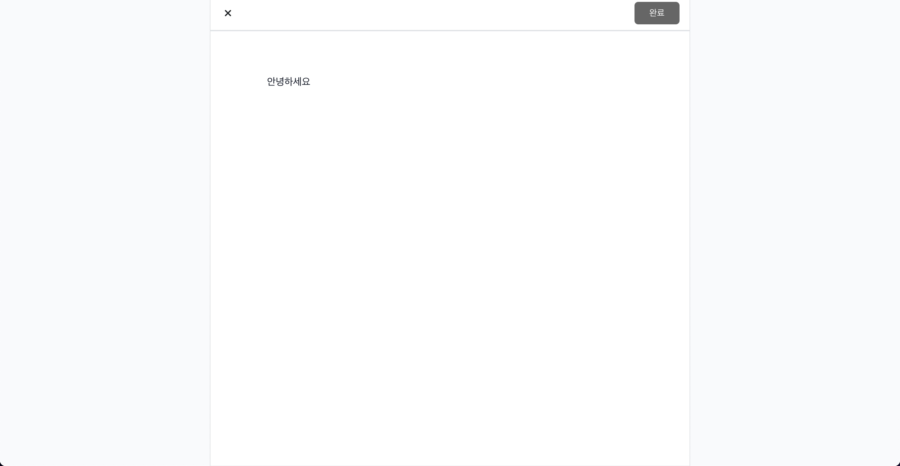
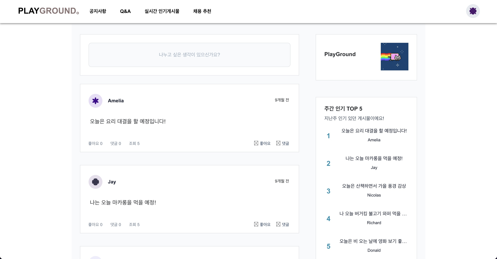
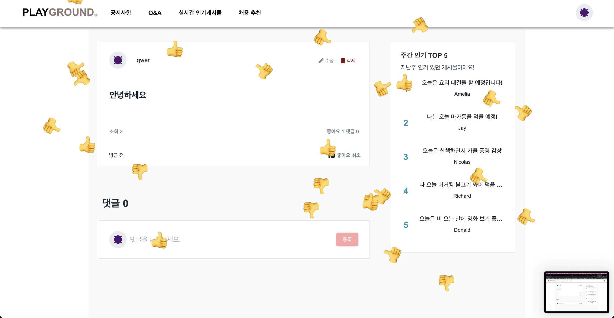

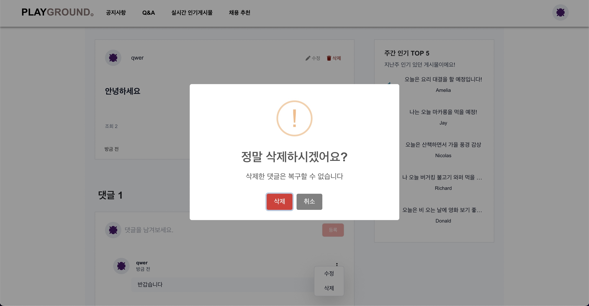
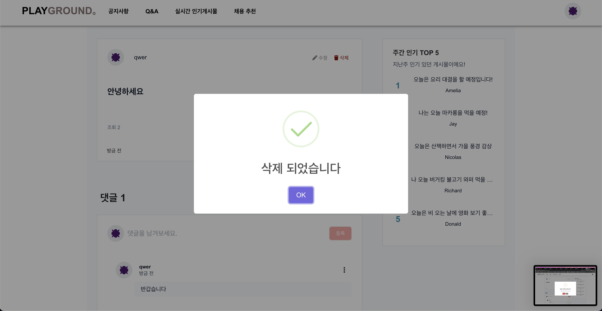

내가 처음으로 프론트를 맡아 구현한 웹사이트이다.
부트캠프내의 원활한 소통창구가 따로 없어서 실제로 쓸 법한 커뮤니티 사이트를 만들어보자라는 아이디어였다. 첫화면 페이지와 메인페이지의 글 작성 삭제 수정 댓글 좋아요 sns 무한스크롤 등의 기능을 디자인과 함꼐 구현했다. 당시 멘토링을 맡았던 삼성 엔지니어분이 여태 부트캠프 멘토링을 하면서 가장 완성도 높아보이는 프로젝트라 말해주었는데 내심 좋았다. (립 서비스일까) 같이 맡은 백엔드 파트너가 있었는데 둘이 이것저것 서로 얘기 하면서 정말 재밌게 작업한 경험이다. 이 경험으로 개발 협업을 통해 생각한걸 만들어내는것에 대한 희열을 느꼈다. 첫프로젝트를 다시 꺼내서 둘러보고 리팩토링하는 시간을 갖고 기록을 남겨 보고 싶다.

### 깃허브 사용법

 

당시 팀리더인 친구가 실무자였어서 제대로 된 깃 협업을 경험해 볼 수 있었는데 지금 생각해 보니 가장 좋은 경험이었던 듯하다. 총 6명이 upstream 원격 저장소를 fork 해서 작업하고 PR Merge 하는 방식이었는데 깃허브로 하루를 꼬박 날린 적도 병합 도중 충돌을 해결하다가 작업 내역을 날려 버릴 뻔한 적도 있다. 이때 경험한 우당탕탕의 기억이 수료 이후에도 계속해서 깃허브를 다루는데 큰 도움이 되었다. 여전히 고마운 제이제이 그리고 여전히 어려운 깃허브.

## 부트캠프 수료

 

막상 부트캠프를 수료하고 나니 더 큰 고민에 빠졌다. 프론트를 지향하고 있는데 프론트에 대한 지식이 거의 없다시피 했다. 파이널 프로젝트로 일단 이력서를 돌려보라지만 그게 말이 되는가 싶어 스스로 납득이 잘 안됐던 거 같다. 공부를 더 해야겠다는 마음을 먹고 프론트를 새로 공부하기 시작한다. ~~(그냥 이력서도 돌려볼껄 그랬을까..?)~~

## 우아한 테크코스 프리코스

혼자 고민하고 머리를 싸매던 중 우아한 테크 코스 6기를 모집 일정을 발견했다. 사실 큰 생각 없이 프론트로 뭔가를 좀 더 해보자는 생각에 지원을 했었는데 프리코스를 참여하면서 신세계를 맞이한 기분을 느꼈고 이때의 경험이 많은 걸 느끼게 해준듯싶다.

**[우테코 회고](https://velog.io/@kyhh/posts?tag=우아한테크코스)**

우테코를 진행하면서 같이 시도해 본 벨로그인데 다시 보니 좀 새롭다. 징징거리는 거 같기도 하고... 꾸준함을 유지하기 위한 노력이 여전히 필요하다.

## 스터디와 사이드 프로젝트

 

결과적으로 우테코는 탈락했지만 계속해서 비슷한 환경에 던져지고 싶어 디스코드 내에서 참가자들끼리 스터디를 모집하는 글을 보고 프론트로 참여를 시작했다. 총 15명 정도의 인원이 3팀으로 나누어 2월부터 시작했고 한차례 1차 발표를 끝낸 후 현재는 각 팀별로 추가적으로 개발하거나 각자의 공부들을 겸하고 있는 중이다. 프로젝트 외에도 그룹 내에서 미니 스터디를 진행했는데 CS와 바닐라 JS 스터디를 같이 진행하면서 지식을 좀 더 쌓고자 했다.

얼마 전에는 정모도 진행했는데 정말 좋은 시간을 보냈다. 일정 때문에 늦게 참가했지만 몇 개월 동안 같이 프로젝트를 한 팀원들도 만나보고 다른 팀과도 소통하던게 짧지만 기억에 많이 남는다. 이런 오프라인 만남이 처음이어서 사실 좀 긴장됐는데 잘한 선택인듯하다. 이후에 2기 팀원들도 추가로 모집하고 있다. 그룹 내에서 다음에 더 좋은 대화를 할 수 있도록 나도 더 성장을 하고 싶다 아니 해야겠다. 가장 좋은 건 관련된 사람들을 더 만날 수 있었다는 것. 마음에 드는 팀원들이 있었다는 것인 거 같다. 꾸준히 참여해서 유지 되도록 노력하자

**[취지직 스터디](https://github.com/CHZZK-Study)**

## 지금의 나는

 

 

이렇게 첫 개발을 경험하고 프론트를 제대로 시작한 지 약 1년이 되어가고 있다. 사실 남들보다 좀 늦은 나이에 공부를 시작했기에 취업이 가장 우선이긴 하지만 여전히 자신감도 좀 떨어지고 과연 내가 할 수 있을까 의심이 들기도 한다. 더욱이 요즘 취업시장도 힘들기에 경쟁이 치열해져 위축되는 탓도 있겠다. 하지만 마음을 먹었고 내가 생각한 끝을 보고 싶기에 포기하지는 않는다. 어떻게든 방법을 찾아내서 도전하고 싶다. 공부한 시간이 꽤 길어지고 있어 자급자족 생활을 해야 하는 나는 생활비 이슈로 잠시 다른 일을 병행하고 있다. 🥲 그래서 그럴까 뭔가 개발이랑 멀어지는 거 같고 머리가 굳어지는듯한 느낌이 들기도 한다. 지금 진행하고 있는 그리고 예정된 프로젝트들이 있는데 같이 하는 팀원들에게도 민폐라 마음이 좋지도 않다. 여러모로 마음도 상황도 어렵지만 이렇게 글을 써보면서 다시 한번 다짐을 하고 싶었다. 글쓰기도 꾸준하게 유지하고 싶어 정을 붙이려고 블로그를 따로 만들어봤는데 손이 잘 가줬으면 좋겠다. 현재는 네이버 부스트 캠프 웹 모바일 9기를 진행하려고 한다. 지난 기수와 다르게 이번에 바뀐 점이 많다는데 뭔가 우테코와 비슷한 느낌일 것 같다는 생각이다. 1차 테스트도 떨어질거 같아서 진짜로 자신 없지만 한 번 더 도전해 보고 결과에 따라 올해 하반기 계획을 잡아보겠다.
