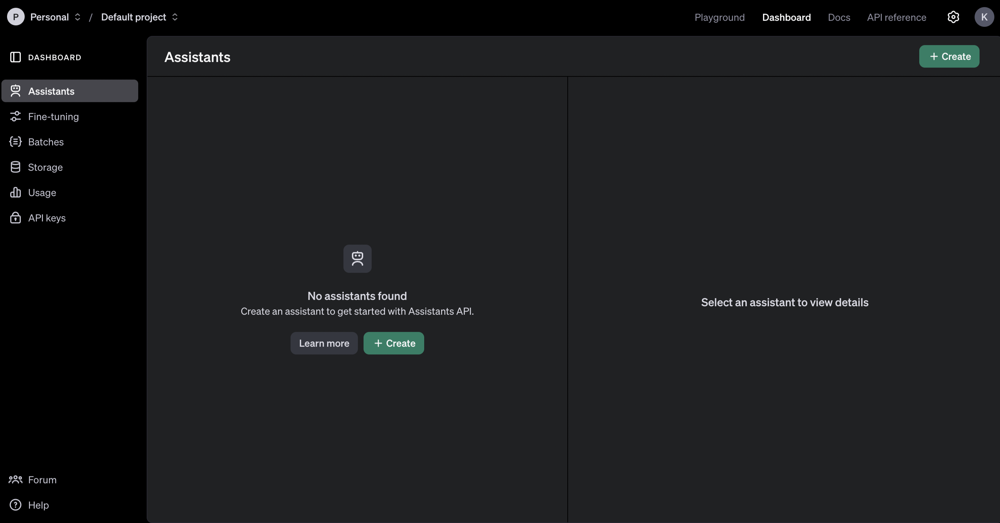
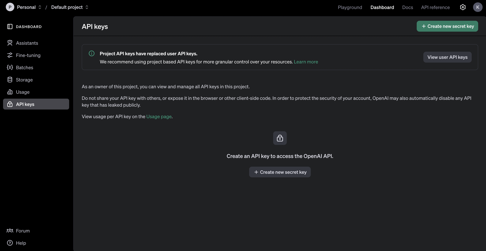
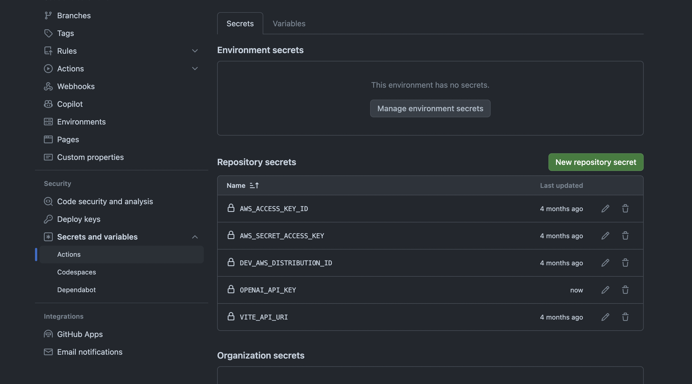
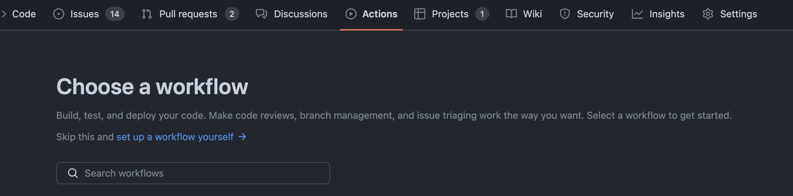
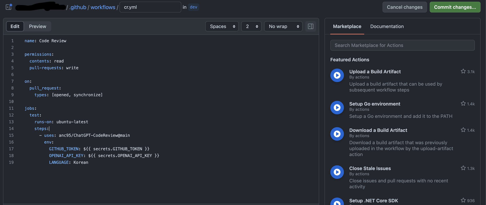
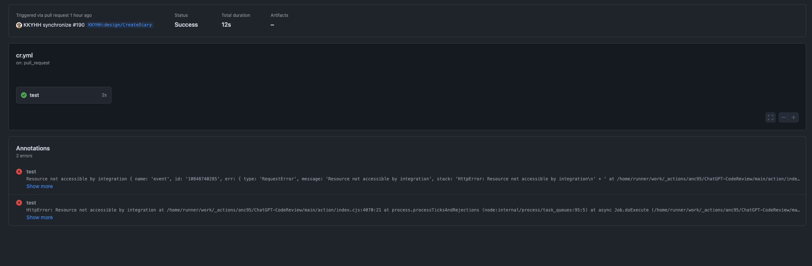

<!-- ---
title: "GPT로 코드 리뷰 해보기"
description: "어떻게 글을 작성하고 추가할까요?"
date: 2024-08-27
update: 2024-08-27
tags:
  - Github Action
series: "개발"
---

## 코드리뷰가 받고 싶다









```yml
# cr.yml

name: Code Review

permissions:
  contents: read
  pull-requests: write

on:
  pull_request:
    types: [opened, synchronize]

jobs:
  test:
    runs-on: ubuntu-latest
    steps:
      - uses: anc95/ChatGPT-CodeReview@main
        env:
          GITHUB_TOKEN: ${{ secrets.GITHUB_TOKEN }}
          OPENAI_API_KEY: ${{ secrets.OPENAI_API_KEY }}
          LANGUAGE: Korean
```


 -->
